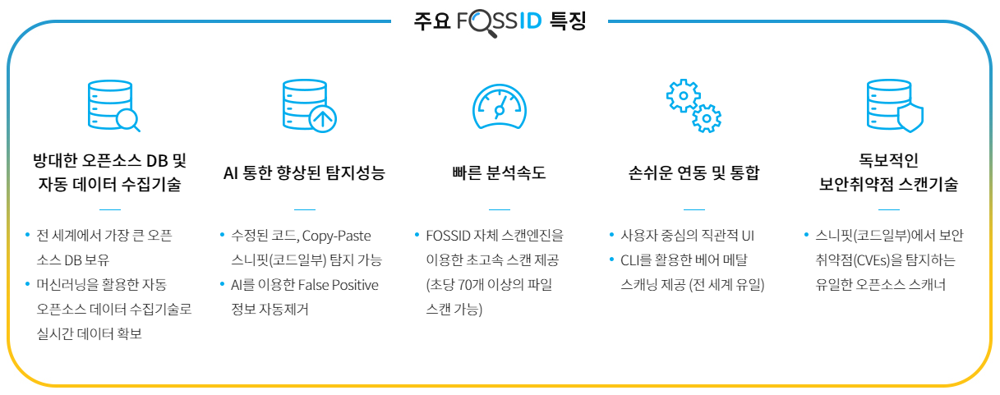

# FossID란

### FossID란?

FOSSID는 오픈소스 라이선스 및 보안취약점 관리를 위한 솔루션입니다. 소스코드 내 모든 오픈소스 컴포넌트를 탐지하고, 각 컴포넌트의 라이선스 및 보안취약점을 식별합니다.

기업은 FOSSID를 활용해, 기업 내 사용된 소스코드가 어떤 오픈소스를 사용하고 있는지 파악하고, 각각의 사용된 오픈소스 컴포넌트가 올바르게 사용되고 있는지를 판단해 이에 대한 대비책을 세울 수 있습니다.

<figure><figcaption></figcaption></figure>

