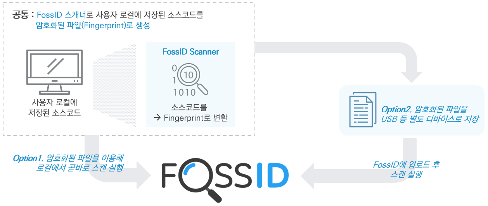

# Blind Audit

Blind Audit은 **자체 코드 보안 스캔 기능**으로, 소스코드 유출 없이 검증을 수행합니다. 별도 암호화된 파일만으로 코드 검증이 가능하므로, 기업은 분석 대상 소스코드를 서버에 업로드할 필요가 없습니다.

WebApp은 업로드된 파일이 암호화된 파일임을 자동으로 인식하여 Blind Audit을 실행합니다. 스캔이 완료되면 Blind Audit 스캔은 일반 스캔과 유사하게 보입니다. 단, 스캔된 소스코드가 로컬 컨텐츠 레이아웃에서 제공되지 않습니다.

다른 모든 기능은 정상적으로 작동하며 사용자는 식별 작업을 진행하고 보고서도 생성할 수 있습니다. 실제 소스코드가 업로드되지 않기 때문에 클립 보드에 복사 및 로컬 파일 다운로드 옵션은 사용할 수 없습니다.

<figure><figcaption></figcaption></figure>

Blind Audit 기능의 절차는 다음과 같습니다.

1. CLI를 다운로드 후 하기 명령어를 통해 `.fossid` 파일을 생성할 수 있습니다.\
   `fossid-cli --local --enable-sha1=1 SCAN_TARGET > FINGERPRINTS.fossid`
2.  FossID Scan 생성 후 `.fossid`를 첨부하여 분석을 실행하면 분석된 결과를 확인할 수 있습니다.\

    <figure><figcaption></figcaption></figure>

    <figure><figcaption></figcaption></figure>


해당 기능과 관련된 자세한 내용은 하기를 참조하십시오.

https://\<FOSSID\_ADDRESS>/help/en/blind-audit/blind-audit-scan.html

