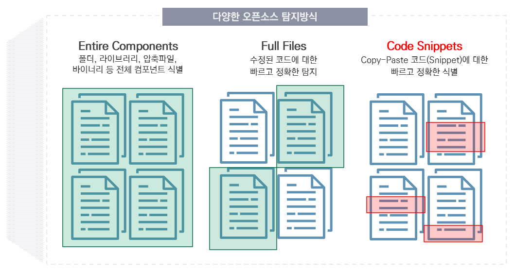

# 다양한 오픈소스 탐지 방식

FossID는 다양한 방식으로 오픈소스를 탐지합니다.

<figure><figcaption></figcaption></figure>

* **Entire Components** : 폴더, 라이브러리, 압축파일, 바이너리 등 전체 컴포넌트를 식별합니다.
* **Full Files** : 파일 단위의 식별이 가능하여 수정된 코드에 대해 빠르고 정확하게 탐지합니다.
* **Code Snippets** : Snippet이란 소스코드의 작은 부분을 뜻합니다. Snippet 단위의 식별을 통해 Copy-Paste한 코드를 탐지할 수 있습니다.
