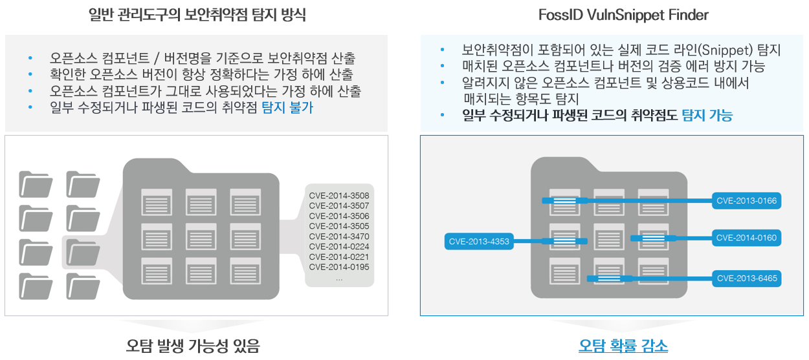

# Vuln Snippet Finder

FOSSID는 업계 최초로 Snippet 단위에서 보안취약점을 탐지합니다.

일부 수정되거나 파생된 코드의 취약점 탐지가 가능해, 오탐 확률이 감소합니다.

<figure><figcaption></figcaption></figure>


해당 기능과 관련된 자세한 내용은 하기를 참조하십시오.

https://\<FOSSID\_ADDRESS>/help/en/vulnerabilities/vsf.html

