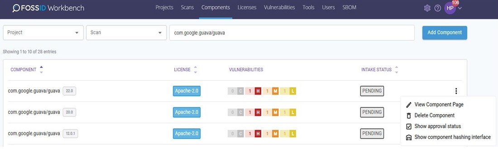

# Components

FossID 웹 애플리케이션은 식별에 사용되었거나 'Add Component'를 통해 Component 데이터베이스에 추가된 모든 Component에 대한 정보를 저장합니다. Component는 일반적으로 취약점, License 등에 대한 정보와 함께 특정 버전의 소프트웨어 패키지를 나타냅니다.

* 권한이 있는 경우, 기존 Component를 편집, 추가할 수 있습니다.

<figure><figcaption></figcaption></figure>

### 검색 필터링

* project 및 scan 별로 사용된 Component를 검색할 수 있습니다.

<figure><figcaption></figcaption></figure>

* Component명 또는 할당된 License명을 기준으로 Component를 검색할 수 있습니다.

<figure><figcaption></figcaption></figure>

### Component 승인 상태 확인

* 'Show approval status'를 클릭하면 각 Component의 승인 상태를 확인할 수 있습니다.

<figure><figcaption></figcaption></figure>
