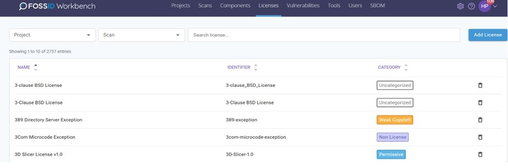

# Licenses

* Workbench의 모든 License 목록이 표시됩니다.
* SPDX License의 경우 identifier를 사용합니다.
* 해당 인터페이스를 이용해 기존 License를 편집하거나 새 License를 추가할 수 있습니다.
* Project 및 Scan 별로 사용된 License 를 검색할 수 있습니다.

<figure><figcaption></figcaption></figure>
