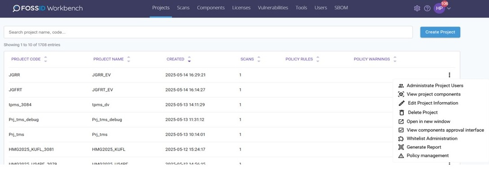

# Projects

자신에게 할당된 모든 Project를 확인 및 관리할 수 있습니다.

<figure><figcaption></figcaption></figure>

* 자신에게 할당된 모든 Project를 확인 및 관리 할 수 있습니다.
* 특정 Project를 클릭하면 해당 Project에 속하는 Scan 목록을 확인할 수 있습니다.
* 새 Project 추가가 가능하며, 특정 Project를 Edit하고 whitelisting rules 리스트를 관리할 수 있습니다.
* Administrate Project Users을 통해 Project에 특정 User에게 접근 권한을 줄 수 있습니다.
* View components approval interface를 통해 특정 project의 할당된 scan에서 식별된 component list를 전체적으로 확인할 수 있습니다.
* Generate Report를 통해 해당 Project의 Report를 생성할 수 있습니다.
* 사용된 Component에 대한 승인 인터페이스를 확인할 수 있습니다.
